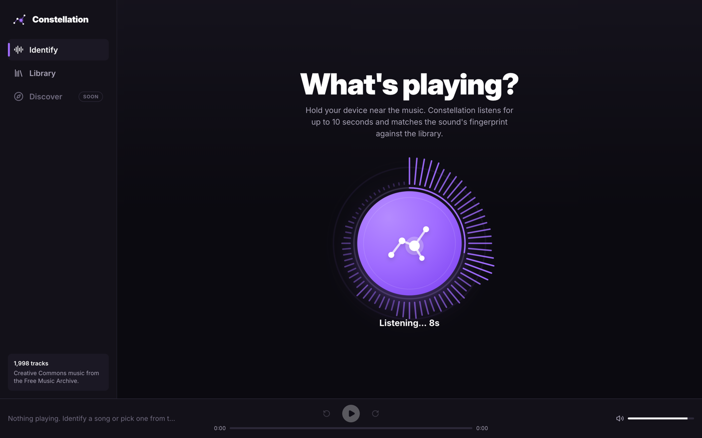
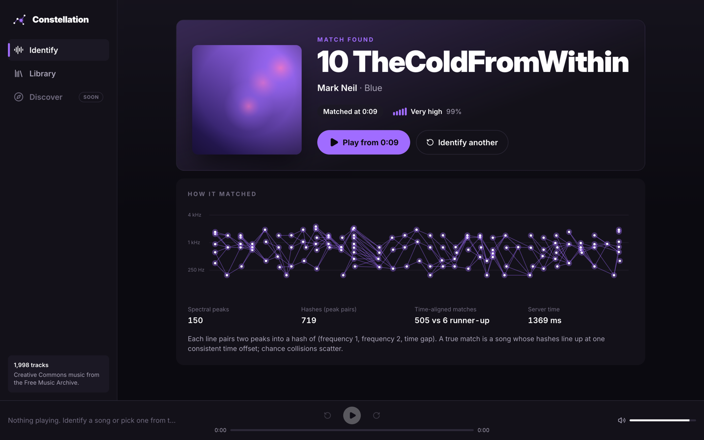
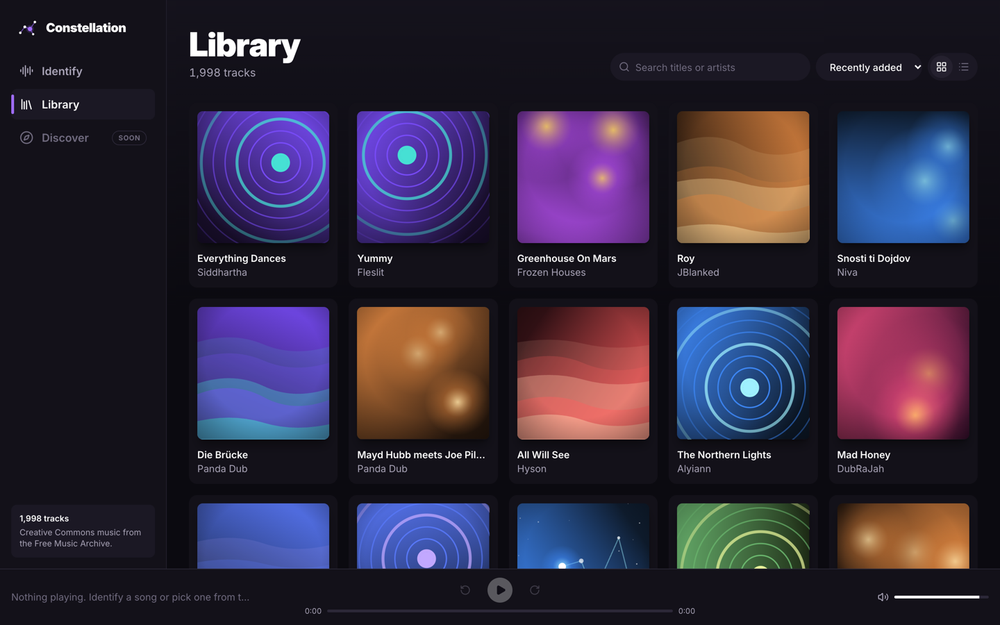
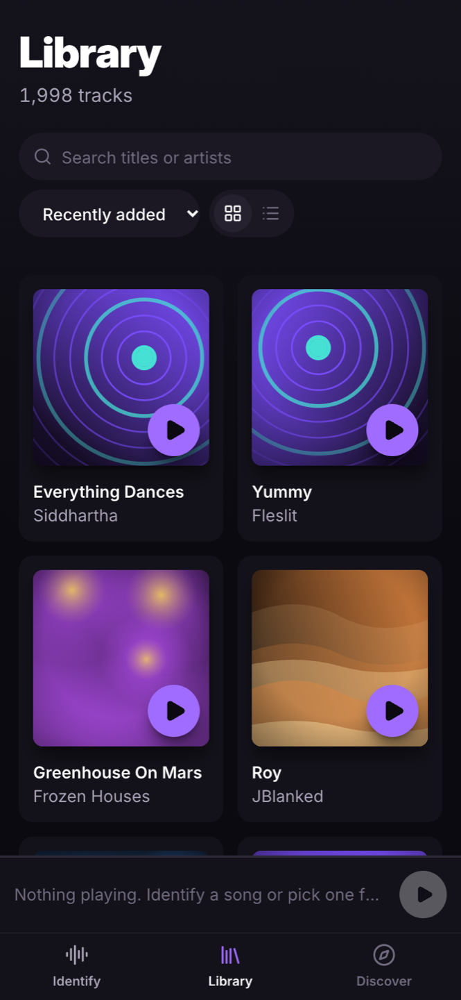

# Constellation

Shazam-style music identification (Phase 1) and audio-similarity discovery (Phase 2, planned).
Record a few seconds of a song, and Constellation tells you what it is and where in the song you are.

> Status: **Phase 1 is complete**: fingerprinting core, Postgres + ingestion CLI, evaluation, HTTP API and web app.
> **Phase 2** (audio-embedding "Discover similar songs") is in progress: embedders, similarity eval, and pgvector storage + ingestion done.

<p align="center">
  
  
</p>

## How it works

```
audio ──ffmpeg──▶ mono 11,025 Hz ──STFT──▶ log spectrogram ──max filter──▶ constellation map
                                                                               │
                              (f1, f2, Δt) packed into a 26-bit int ◀──pair anchors with target zone
                                                                               │
          index: hash → (song_id, anchor_time)      query: look up hashes, histogram
                                                    (db_time − query_time) per song,
                                                    tallest bin wins → song + offset
```

| Step | Module | Key idea |
|---|---|---|
| Decode | `audio/loader.py` | ffmpeg decodes any format (incl. browser webm/opus), downmixes and resamples in one native pass |
| Spectrogram | `fingerprint/spectrogram.py` | Hann-windowed STFT in dB; frames are not centered, so frame indices map to absolute sample positions |
| Peaks | `fingerprint/peaks.py` | 2D max filter + threshold relative to the clip's loudest point (volume invariant) + top-k per second (bounded density) |
| Hashing | `fingerprint/hashing.py` | Peak *pairs* carry about 26 bits (vs. about 9 for one peak) and store only Δt, so they're invariant to where the clip starts |
| Matching | `matching/matcher.py` | True hits all agree on one offset; chance hits scatter. The tallest offset-histogram bin measures time-coherent agreement |
| Storage | `storage/` | `Protocol` interfaces with in-memory and Postgres implementations; swap in e.g. Redis by implementing `add_fingerprints` + `lookup` |
| Ingestion | `pipeline/` | One place that processes a song into **every** index (see below) |

All parameters live in `config.py` (`FingerprintConfig`, `MatchConfig`). `FingerprintConfig.version()` hashes them, so an index knows which config produced it.

## Ingestion pipeline

```
file ─▶ plan (sha256 + index-status lookup) ─▶ compute (worker processes) ─▶ commit (1 transaction/song)
        skip if every index is current           decode once per sample rate   insert song, replace stale rows,
                                                 run each Indexer.compute      write rows + song_indexes marker
```

- **Indexers** (`pipeline/indexers.py`) each declare a `name`, a `version` (a hash of their config) and the `sample_rate` they need. Phase 2 adds an `EmbeddingIndexer` next to `FingerprintIndexer`. Re-running `ingest` then backfills only the new index.
- **Idempotency** is tracked per `(song, index)` in `song_indexes`. The marker is committed in the same transaction as the index rows, so an interrupted run never leaves a half-indexed song. Songs are keyed by content hash, so a renamed copy isn't re-ingested.
- **Config changes** alter an indexer's version, and the next run replaces that index's rows for each song. A mixed-version index would silently break matching.

## Database schema

| Table | Purpose |
|---|---|
| `songs` | Library metadata; `content_hash` UNIQUE is the idempotency key |
| `song_indexes` | `(song_id, index_name) → version, item_count`: which indexes each song has, and with which config |
| `fingerprints` | `(hash INT, song_id INT, anchor_time INT)`, no primary key. A B-tree on `hash` for lookups; a BRIN index on `song_id` for re-indexing |

Why no primary key on `fingerprints`? The table is append-only and only ever read by `hash`. A surrogate key would add about 30% to the biggest table for nothing. Rows are bulk-loaded with **binary COPY**, with the payload built by numpy.

## Evaluation

`eval/run_eval.py` queries the ingested library with random 5 s and 10 s clips, degraded eight ways. It also queries **held-out FMA songs that aren't in the library**, to measure false positives. Full output, including setup details, is in [`eval/results/results.md`](eval/results/results.md).

**Headline (2,000-song library, 6,384 queries):** 100% top-1 on clean, low-pass, 32 kbps MP3 and simulated phone recordings. 95.5% / 99.0% (5 s / 10 s clips) at 0 dB SNR. **0 false positives** in 1,600 held-out queries. p95 latency **33 ms** (5 s clip). 257 MB database.

| Condition | 5 s clip | 10 s clip | 5 s raw top-1 | 10 s raw top-1 |
|---|---:|---:|---:|---:|
| Clean | 100.0% | 100.0% | 100.0% | 100.0% |
| White noise, 15 dB SNR | 100.0% | 100.0% | 100.0% | 100.0% |
| White noise, 5 dB SNR | 99.0% | 100.0% | 100.0% | 100.0% |
| White noise, 0 dB SNR | 95.5% | 99.0% | 99.0% | 100.0% |
| White noise, -5 dB SNR | 74.5% | 92.0% | 96.0% | 97.5% |
| Low-pass 3.4 kHz | 100.0% | 100.0% | 100.0% | 100.0% |
| MP3 32 kbps | 100.0% | 100.0% | 100.0% | 100.0% |
| Phone sim (band-pass + 10 dB noise + MP3) | 100.0% | 100.0% | 100.0% | 100.0% |

*Top-1* = returned a match (confidence ≥ 0.25, ≥ 5 aligned hashes) **and** it was the right song. *Raw top-1* ignores the no-match threshold.

**False positives:** 0 of 1,600 held-out test queries returned a song, across all conditions.

**How the no-match threshold was chosen:** each query's raw scores are recorded. The confidence threshold is the lowest value with zero false positives on a *calibration* half of the negative queries, and it's then evaluated on the other, disjoint half. The trade-off:

| Confidence threshold | Top-1 accuracy | False-positive rate |
|---:|---:|---:|
| 0.00 | 99.5% | 58.3% |
| 0.05 | 99.4% | 11.4% |
| 0.10 | 99.2% | 2.6% |
| 0.15 | 98.8% | 1.1% |
| 0.20 | 98.5% | 0.2% |
| 0.25 ← chosen | 97.5% | 0.0% |
| 0.30 | 97.1% | 0.0% |
| 0.40 | 96.1% | 0.0% |
| 0.50 | 95.0% | 0.0% |

At −5 dB SNR the right song is still ranked first 96–98% of the time ("raw top-1"). Most of the drop after thresholding is the matcher correctly saying *"not confident"* rather than guessing. That's the behaviour you want from an ID service.

**An audit finding:** the first run forced the threshold up to 0.85. The cause was one held-out song, Let Me Crazy's "Intro", which "falsely" matched the library's "Outro" from the same album. It turned out the Outro reprises the Intro: 72 aligned hashes at a constant offset. That's a *correct* identification of shared audio, so the track is excluded from the negatives, documented in `eval/shared_audio_exclusions.txt`.

**Offset accuracy:** Median |error| **9 ms**, p95 21 ms; 98.9% within 100 ms (one STFT frame = 23 ms).

**Latency** (fingerprint + Postgres lookup + scoring, sequential, warm cache; Apple Silicon laptop):

| Clip | Mean | p50 | p95 | Fingerprint | DB lookup | Scoring | Hashes / query | DB rows hit |
|---|---:|---:|---:|---:|---:|---:|---:|---:|
| 5 s | 19 ms | 17 ms | **33 ms** | 5 ms | 13 ms | 1 ms | 344 | 6,544 |
| 10 s | 33 ms | 31 ms | **48 ms** | 10 ms | 21 ms | 1 ms | 709 | 12,817 |

**Index size:**

| Songs | Fingerprint rows | Rows / song | Fingerprint table | Indexes | Whole DB |
|---:|---:|---:|---:|---:|---:|
| 1,998 | 4,341,747 | 2,173 | 183 MB | 64 MB | 257 MB |

About 2,170 hashes per 30 s clip. That extrapolates to about 1 GB for all 8,000 fma_small tracks. The DB lookup dominates latency; the offset-histogram scoring is vectorized numpy and takes about 1 ms.

Reproduce:

```bash
.venv/bin/python scripts/download_fma.py --skip 2000 --limit 200 --out data/fma_holdout   # never ingested
.venv/bin/python eval/run_eval.py --songs 200 --negatives 200
```

## HTTP API

`constellation serve` starts FastAPI on `localhost:8000`, with interactive docs at `/docs`.

| Method & path | Purpose |
|---|---|
| `POST /identify` | Multipart `file` (any format ffmpeg reads, incl. browser WebM/Opus and Safari MP4). Returns `match`, `song`, `offset_s`, `confidence`, the query's constellation `peaks`, and a timing breakdown. "No match" is a normal `200` with `match: false`. |
| `POST /songs` | Multipart `file` + optional `title` / `artist` / `album`. Runs the same ingestion pipeline as the CLI. `201` if new; `200` + `outcome: "skipped"` if identical audio already exists. |
| `GET /songs` | `q` (title/artist search), `sort` (`id`/`title`/`artist`/`duration_s`/`created_at`), `order`, `limit` ≤ 500, `offset` → `{items, total}` |
| `GET /songs/random` | A random library song (for the demo's "play something" button) |
| `GET /songs/{id}` | One song |
| `GET /songs/{id}/audio` | Streams the file with HTTP Range support (`206 Partial Content`), so the player can seek straight to the matched offset |
| `GET /health` | Song count and the fingerprint-config version the API queries with |

```bash
curl -F "file=@clip.webm" localhost:8000/identify
```

Design notes:
- **Sync endpoints on purpose.** Decoding and fingerprinting are CPU-bound and psycopg is used synchronously, so the endpoints are plain `def`. FastAPI then runs them in its threadpool instead of blocking the event loop. Each worker thread pins its own pooled connection for transactions.
- **Uploads are bounded.** They're read in chunks and rejected with `413` once over the limit (15 MB for identify, 60 MB for songs). Only the first 20 s of a query is fingerprinted. Undecodable input returns `422` without leaking ffmpeg output or server paths.
- **Content-addressed storage.** Uploaded songs are stored as `data/uploads/<sha256>.<ext>`: no path traversal via file names, and duplicate uploads are free.
- **Cold-start warm-up.** On startup the API loads the fingerprint table and index into Postgres' cache with `pg_prewarm`. After a DB restart, the first identify took 3.4 s (the B-tree read page by page from disk); with warm-up it takes about 0.1 s.
- **Measured end to end** (8 s WebM/Opus clip over HTTP, warm): about 65 ms, of which ~38 ms is ffmpeg decode, ~9 ms fingerprint and ~18 ms match. One uvicorn worker sustains **~41 identify req/s** at 8 concurrent clients (p95 224 ms). Numpy work holds the GIL, so throughput scales with `--workers`.

## Web app

React 19 + TypeScript + Vite + Tailwind CSS v4, in `frontend/`.

<p align="center">
  
  
</p>

- **Identify:** record from the mic (MediaRecorder, up to 10 s; the eval shows 10 s clips hold ~99% accuracy at 0 dB SNR) or upload a clip. While listening, a radial frequency halo is drawn from a Web Audio `AnalyserNode`. While matching, a constellation map animates. The result card shows cover, title, artist, "matched at 1:23", a confidence meter, and **Play from 1:23**. Below it, "How it matched" draws the server's real peaks and peak-pair hashes with the aligned-match counts.
- **Demo mode:** "Play a random library song" plays a track, so you can identify it from a phone, or from the same laptop with the volume up.
- **Library:** grid of cover cards (hover lift, play badge) or a sortable track list (#, title, artist, duration), with server-side search and infinite scroll.
- **Player bar:** persistent, with play/pause, ±10 s, a scrub bar, volume, the Space shortcut, and Media Session (lock-screen) controls.
- **Responsive:** the sidebar becomes a bottom tab bar on phones, and the record button sits in the lower half of the screen for thumb reach. Honors `prefers-reduced-motion` (CSS animations off; canvas visualizations render static or at a calm rate).

Design notes:
- **Mic processing is disabled** (`echoCancellation`, `noiseSuppression`, `autoGainControl`). Browsers tune these for voice calls: they treat music as noise and cancel audio the device is playing itself, which is exactly the signal we need.
- **Generated covers.** FMA lacks reliable album art, so each song gets a deterministic SVG cover from its id: a seeded PRNG picks one of 10 curated palettes and 4 compositions. Same song, same cover, everywhere, with zero storage or requests.
- **Two player contexts.** Playback time updates every frame, so it lives in its own context. The dozens of `SongCard`s and `TrackRow`s subscribe only to "which song, playing or not", and don't re-render 60× per second.
- **Seeking via HTTP Range.** "Play from 1:23" sets `currentTime` after metadata loads. The API's Range support means the browser fetches from the offset instead of downloading the whole file.
- **Reusable pieces for Phase 2.** `SongCard` (with an optional `caption`, e.g. "92% similar"), `TrackRow`, `PlayerBar`, `RecordButton`, `CoverArt` and `ConstellationViz` are standalone components. The Discover nav item is already stubbed.
- **Verified end to end in headless Chrome**, driven with a WAV file as a fake microphone: record → WebM/Opus upload → correct match at the right offset. The same run covered the upload flow, library views, mobile layout and reduced motion, with no console errors.

## Phase 2: similar-sounding songs (in progress)

Fingerprints only match *the same recording*. Phase 2 adds a second index of **CLAP** audio embeddings (`embedding/clap.py`). CLAP maps audio and text into one 512-d space, so a single model gives both "songs that sound like this" and "describe a sound" text search. Each song vector is the normalized mean of its 10 s window embeddings.

**Similarity eval** (`eval/run_similarity_eval.py`, 1,998 songs, leave-one-out, k = 10; full report in [`eval/results/similarity.md`](eval/results/similarity.md)):

| Embedding | Genre P@10 | Genre P@10, artist-filtered | kNN genre acc. | Same-artist hit@10 |
|---|---:|---:|---:|---:|
| Random | 12.8% | 12.6% | 13.7% | 3.0% |
| Hand-crafted (MFCC / chroma / spectral contrast) | 35.5% | 32.4% | 47.4% | 36.9% |
| **CLAP** (`laion/clap-htsat-unfused`) | **52.0%** | **48.0%** | **63.6%** | **54.6%** |

- **CLAP beats the classic features in all 8 genres.** Zero-shot genre classification from text prompts alone reaches 35.9% (chance 12.5%). A clean 10 s clip retrieves its own song first 97.5% of the time.
- **Artist-filtered precision** drops same-artist neighbours before scoring. Songs from one album sound alike *and* share a genre label, so without the filter a model could score well by finding the same album.
- **Genre agreement is a proxy.** Two "Rock" tracks can sound nothing alike, and FMA's Experimental and International labels are broad; those are the weakest genres for every method.

Findings along the way:
- **The obvious checkpoint was broken.** `laion/larger_clap_music` scored at chance, with every text query returning the same three songs. Our code matched the reference forward pass exactly. Its Hugging Face checkpoint stores the contrastive temperature as ~0.03 (exp → 1.0, an untrained value), and its song vectors are nearly parallel (mean pairwise cosine 0.89). `clap-htsat-unfused` passes the same checks (temperature 18.7, mean cosine 0.50).
- **Mean-centering was tested and rejected.** Subtracting the library mean (a common fix for "hub" vectors) moved audio P@10 only 52.0% → 53.5%, and the vectors showed no hubness problem to begin with. It isn't worth a stored library statistic that has to be recomputed as songs are added.
- **Cost:** 244 ms per 30 s song on the M2 GPU (MPS), and 2 KB per song, versus about 2,170 fingerprint rows (~120 KB with index) per song.

**Storage and ingestion.** Vectors live in Postgres via **pgvector**, in `song_embeddings (song_id, model, vec)`, with an HNSW index. `EmbeddingIndexer` plugs into the Phase 1 pipeline unchanged. `constellation ingest --indexes embedding` backfilled all 1,998 songs in 7 minutes without touching the fingerprints, and the stored vectors match the eval's to 5×10⁻⁸. HNSW against exact search, every song querying its 10 nearest ([`eval/results/vector_index.md`](eval/results/vector_index.md)):

| Method | Recall@10 | p50 | p95 |
|---|---:|---:|---:|
| pgvector HNSW, `ef_search` 40 (default) | 99.9% | 1.5 ms | 2.1 ms |
| pgvector exact (sequential scan) | 100% | 3.9 ms | 5.0 ms |

Design notes:
- **One table, many models.** HNSW needs a fixed dimension, but the `vec` column is dimension-less so different models can share it. Each model gets a *partial expression index*: `USING hnsw ((vec::vector(512)) vector_cosine_ops) WHERE model = 'clap-htsat'`. A test checks the query plan really uses it.
- **Two-pass ingestion.** CPU-bound fingerprinting fans out over worker processes; the model-based indexer runs in one process on the GPU. Separate workers would each load a 0.6 GB model copy, which doesn't fit in 8 GB of RAM.
- **`ef_search` is at least the LIMIT.** The eval showed HNSW returns at most `ef_search` rows (recall capped at 90% for `ef_search` 10 with an 11-row query), so the store raises `ef_search` for large *k*.
- **Docker image choice.** The DB image moved to `pgvector/pgvector:pg16-trixie`. The plain `pg16` tag is built on Debian bookworm (glibc 2.36), while the original `postgres:16` volume was created on trixie (glibc 2.41). Postgres warned of a collation-version mismatch, which can silently corrupt text B-tree indexes such as the `content_hash` idempotency key. Matching the OS avoids it.

## Setup

Requires Python 3.11+, ffmpeg, Docker, and Node 20+.

```bash
python3 -m venv .venv && .venv/bin/pip install -e '.[dev]'
# Phase 2 similarity search also needs:  .venv/bin/pip install -e '.[embeddings]'   (~2 GB incl. model)
docker compose up -d                       # Postgres 16 on localhost:5433
.venv/bin/constellation db init

# Data: FMA metadata + a genre-balanced subset of fma_small, fetched via HTTP range
# requests (no 7 GB zip on disk). Re-runnable; --limit 8000 gets the full set.
.venv/bin/python scripts/download_fma.py --limit 2000

.venv/bin/constellation ingest data/fma_small --metadata data/fma_metadata/tracks.csv   # fingerprints (+ CLAP if installed)
.venv/bin/constellation db stats
.venv/bin/constellation identify path/to/clip.m4a
.venv/bin/constellation serve --reload     # API on :8000, docs at /docs

cd frontend && npm install && npm run dev  # web app on http://localhost:5173 (proxies the API)
```

To try the demo from a phone on the same network, open `http://<your-laptop-ip>:5173`. Note that browsers only allow microphone access on `https` or `localhost`, so for phone recording serve the app over HTTPS (e.g. a tunnel such as `cloudflared` or `ngrok`). Uploading a clip works over plain HTTP.

Set `CONSTELLATION_DATABASE_URL` to point at a different database.

## Development

```bash
python3 -m venv .venv && .venv/bin/pip install -e '.[dev]'
.venv/bin/pytest            # Postgres tests auto-skip if the compose DB isn't running
.venv/bin/pytest -m "not integration"
```
